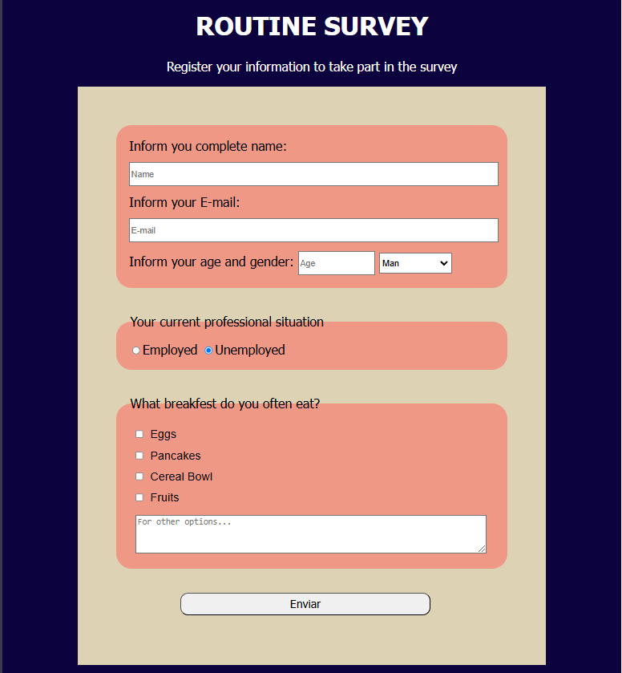

# Routine Survey

Projeto de formulário criado como parte dos exercícios do freeCodeCamp.

## 💻 Prévia do projeto

## 📋 Descrição

Este formulário coleta informações básicas de rotina como:
- Nome completo
- E-mail
- Idade e gênero
- Situação profissional
- Preferências de café da manhã

## 🛠️ Tecnologias usadas

- HTML
- CSS

## 📁 Como visualizar

Basta abrir o arquivo `SurveyFormProject.html` em qualquer navegador.

---

Projeto feito como parte do curso de **Responsive Web Design** no freeCodeCamp.
